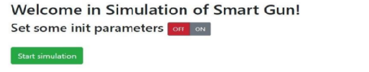
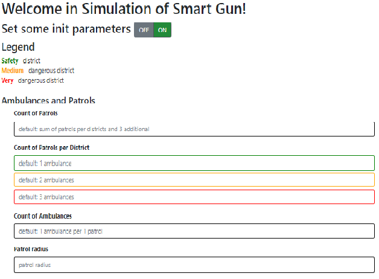
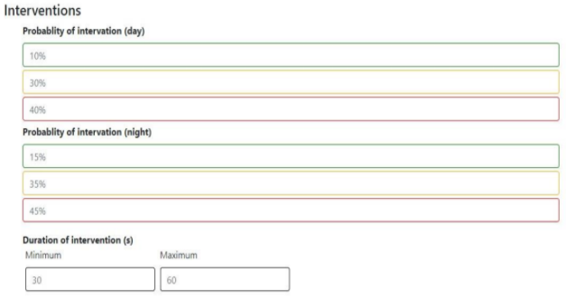
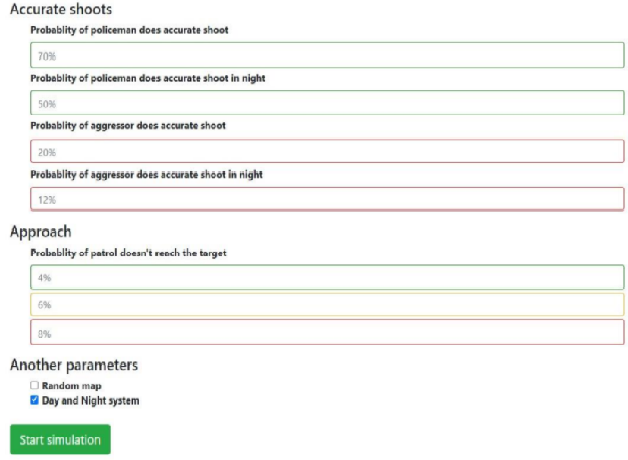

# SmartGun

# QuickStart
1. Clone the repository
2. Go to initial folder `cd initial`
3. In the IntelliJ, go to the root of the project right click on the `pom.xml` and select the option `+ Add Maven Project`
4. Serve application:

    5.1. Linux: `./mvnw spring-boot:run`
    
    5.2. Windows: `mvnw.cmd spring-boot:run`
5. Visit `localhost:8080` and try this app

# Demo Usage
1. Select `ON` button to set your own starting data

   
2. Now you can set the data

   - The colors above indicate the level of danger in the sector. The green sector is the safest and the red sector is the most dangerous

3. Enter your data of interventions. If you'll don't do it, client will set automatically grey numbers as starting data 

3. Get do the same with each other parameters you want to change and select `Start simulation` green button

    - The `Day nad Night system` means at the night probability of intervention is higher. If you uncheck this option, the probability of all incidents will be the same for the duration of the simulation

# Websocket for Java and Javascript documentation
https://spring.io/guides/gs/messaging-stomp-websocket/
